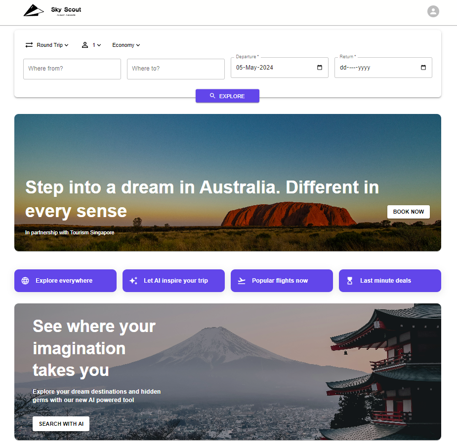

The Sky Scout web application is crafted to offer a detailed platform for users to compare flight fares, along with other critical flight details like departure and arrival times, across various airlines. This enables travellers to choose the most suitable option for their itinerary based on their specific preferences.

## Getting Started

First, run the development server:

```bash
npm run dev
# or
yarn dev
# or
pnpm dev
# or
bun dev
```

Open [http://localhost:3000](http://localhost:3000) with your browser to see the result.

You can start editing the page by modifying `app/page.tsx`. The page auto-updates as you edit the file.

Before running application locally, ensure .env file is updated with correct url (NEXT_PUBLIC_WEB_API_URL=http://localhost:8888/api) and run the backend at: https://github.com/NUS-ISS-Projects/flight-backend

## Deploy on Vercel

The easiest way to deploy your Next.js app is to use the [Vercel Platform](https://vercel.com/new?utm_medium=default-template&filter=next.js&utm_source=create-next-app&utm_campaign=create-next-app-readme) from the creators of Next.js.

Check out our [Next.js deployment documentation](https://nextjs.org/docs/deployment) for more details.

## Application on Vercel

Check out the application at: https://flight-frontend-lilac.vercel.app/


